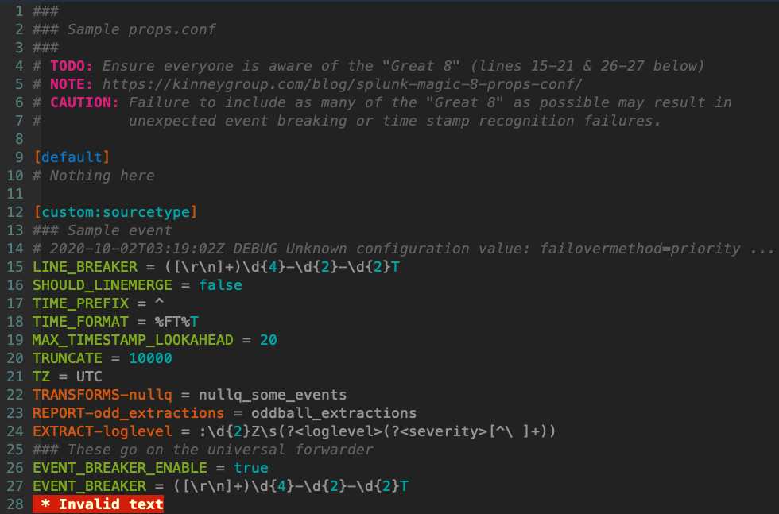

Syntax highlighting for Splunk's .conf files
=============

This project is released under the Zero Clause BSD license. Feel free to create your own branch and submit a pull request via Github or email me: colbyw at gmail dot com.

Thanks to the many contributors to this project.

Starting with the 7.0 branch and master commit `cbe67eb437e8f8fb0b0db829adf18bb5d4679821`, vim-splunk utilizes pattern matching to ensure proper keyword spelling and placement. In an effort to reduce CPU overhead, the majority of .conf file associations were moved from a monolithic .vim file to a set of federated .vim files, one .vim per .conf(.spec).



Installation Instructions
=============

You can either clone the repository somewhere on your file system and use symlinks to the corresponding directories or clone to `~/.vim/bundle` as a submodule.

Symlink instructions:
```
mkdir ~/git-projects
cd ~/git-projects
git clone https://github.com/yorokobi/vim-splunk.git
if [ ! -d ~/.vim/ftdetect ] ; then mkdir -p ~/.vim/ftdetect ; fi
if [ ! -d ~/.vim/syntax ] ; then mkdir -p ~/.vim/syntax ; fi
ln -s ~/git-projects/vim-splunk/ftdetect/splunk.vim ~/.vim/ftdetect/splunk.vim
ln -s ~/git-projects/vim-splunk/syntax/* ~/.vim/syntax/
```
Bundle instructions:
```
cd ~/.vim/bundle
git clone https://github.com/yorokobi/vim-splunk.git
```
Submodule instructions:
```
cd ~/your/vim/bundle/repo
git submodule add https://github.com/yorokobi/vim-splunk.git
git commit -am "Added vim-splunk as a submodule"
```
